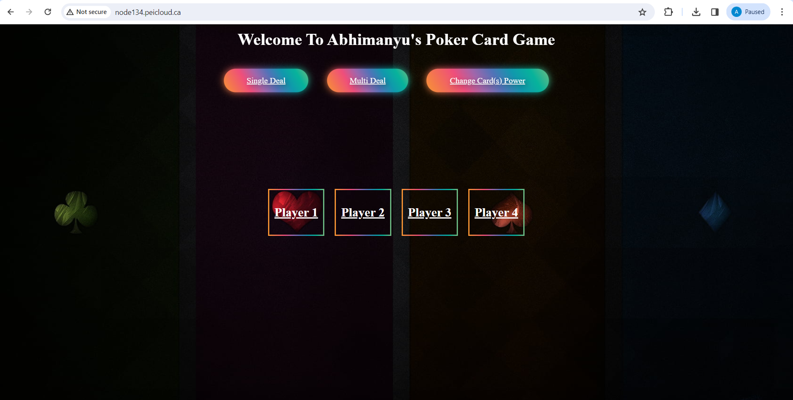
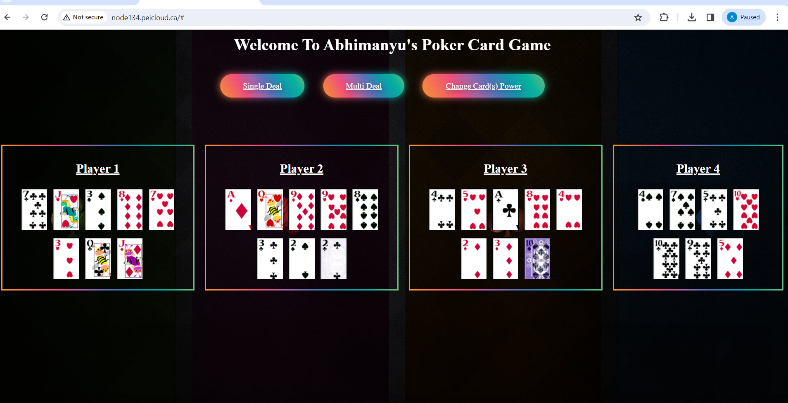
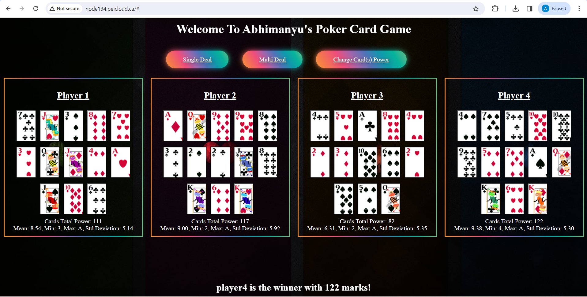
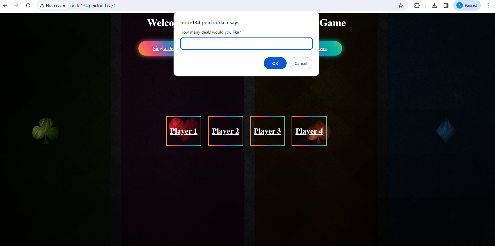
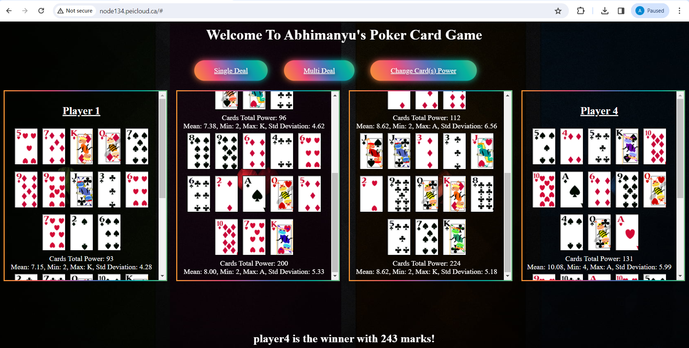
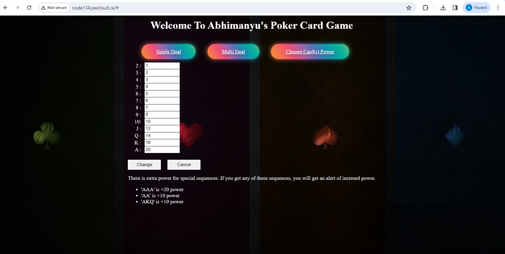

# Online-Poker-Platform-Innovative-Card-Gaming-Experience

## Overview
Developed a web-based poker card game platform using HTML, CSS, and JavaScript, offering users an engaging and interactive experience. The game allows players to enjoy the classic game of poker by dealing cards and determining the winner based on card power calculations. Additionally, the platform incorporates features such as card shuffling for randomness, customization of card powers, and the calculation of luck factors including mean, median, maximum, and minimum card powers for each player. This project showcases proficiency in web development technologies and demonstrates innovation in creating a dynamic gaming environment.

## Table of Contents

- [Installation](#Installation)
- [Usage](#Usage)
- [Project Discription](#Project-Description)
- [Achievements](#Achievements)
- [Screenshots](#Screenshots)

## Installation
1. Clone this repository to your local machine.
2. Open the index.html file in your preferred web browser.

## Usage
1. **Single Deal**: Click on the "Single Deal" button to deal cards for a single round. This option is suitable for quick games or practice sessions.
   
2. **Multi Deal**: Use the "Multi Deal" button to deal cards for multiple rounds. Enter the desired number of deals when prompted, and the game will automatically deal cards for the specified number of rounds. This feature is ideal for longer gaming sessions or tournaments.

3. **Change Card(s) Power**: Click on the "Change Card(s) Power" button to customize the power of individual cards. Adjust the power values for each card type according to your preferences. This allows for fine-tuning the game dynamics and introducing variations in gameplay.

4. **Playing the Game**: After dealing cards, observe the cards dealt to each player and their respective powers. Special sequences such as 'AAA', 'AA', and 'AKQ' provide bonus power, so keep an eye out for these combinations.

5. **Determining the Winner**: The winner is determined based on the highest total power accumulated from the dealt cards. The player with the most powerful combination of cards wins the round. The game automatically calculates and displays the winner at the end of each round.

6. **Exploring Luck Factors**: Take advantage of the luck factor calculations provided by the platform. Explore statistics such as mean, median, maximum, and minimum card powers for each player to gain insights into their performance and luck in the game.

7. **Enjoying the Experience**: Sit back, relax, and enjoy playing poker in a convenient and user-friendly online environment. Whether you're playing solo or with friends, this platform offers an immersive gaming experience that guarantees entertainment.

## Project Description
This project introduces a web-based poker card game platform developed using HTML, CSS, and JavaScript. It delivers an immersive gaming experience by offering features like single or multi-round gameplay, customizable card powers, and advanced luck factor calculations. Players can engage in dynamic and strategic gameplay, enjoying seamless card dealing and winner determination. With its intuitive design, the platform ensures an enjoyable experience whether playing alone or with friends.

With a focus on user engagement and strategic depth, this web-based poker card game platform stands out for its polished interface and innovative features. By incorporating customizable card powers and sophisticated luck factor calculations, players can tailor their gaming experience and gain insights into their performance. The platform's seamless functionality and intuitive design make it suitable for both casual gamers and poker enthusiasts, offering an immersive and enjoyable gaming experience that keeps players coming back for more.

## Achievements
**Creative Implementation of Customization:** Demonstrated exceptional creativity by implementing customizable card powers and advanced luck factor calculations, showcasing proficiency in designing complex gaming mechanics and enhancing user engagement.
**Skillful Handling of Complexity:** Successfully managed the intricacies of game development by seamlessly integrating features such as single or multi-round gameplay, card shuffling for randomness, and dynamic winner determination algorithms, highlighting adeptness in handling complexity in programming projects.
**Proficiency in HTML, CSS, and JavaScript:** Leveraged expertise in HTML, CSS, and JavaScript to craft a polished and intuitive user interface, ensuring a seamless and enjoyable gaming experience for players of all skill levels.
**Innovative Solutions for User Experience Enhancement:** Introduced innovative solutions to enhance user experience, including intuitive interface design, interactive gameplay elements, and sophisticated statistical analyses, reflecting a keen understanding of user needs and preferences.

## Screenshots
**This screen is shown after you open index.html in your browser:** 
It has Buttons to select Single Deal , Multi Deal or Change Power Settings

**

